# Open Desktop GPT — Application

<p align="left">
  
  
  
  
  
</p>



> **Note:** This directory contains the source code for the Open Desktop GPT desktop application. For the main project documentation, please see the [root README](../README.md).

## What is this?

A desktop app that turns raw sources into a structured, interlinked knowledge base — powered by any LLM. It uses Tauri, React, and Typescript to provide a native app experience with a sidebar, markdown reader, and dashboard.

## Features

- **Tauri-based native app** — fast, lightweight, and cross-platform
- **React 18 + Vite** — modern frontend stack
- **TailwindCSS + shadcn/ui** — beautiful, accessible components
- **Rust Backend** — handles file system watching, LLM compilation, and local interactions
- **Multi-provider LLM Support** — works with Claude, OpenAI, Gemini, or Ollama

## Development Setup

### Prerequisites
- Node.js 18+
- pnpm (`npm install -g pnpm`)
- Rust toolchain

### Install Dependencies

```bash
pnpm install
```

### Run the App in Development Mode

```bash
pnpm tauri dev
```

This will launch the application and automatically reload the frontend on changes. The Rust backend will recompile when files in `src-tauri` change.

### Build for Production

```bash
pnpm tauri build
```

This will generate the installers/executables for your operating system in `src-tauri/target/release/bundle`.

## Architecture Overview

The app is divided into two main parts:

1. **Frontend (`src/`)**: React application handling the UI, state, and rendering markdown (Dashboard, Reader, Q&A).
2. **Backend (`src-tauri/src/`)**: Rust backend managing the file system, configuration, LLM compilation pipelines, and native OS integrations.

### Detailed Folder Structure

```
app/
├── src/                    # React frontend
│   ├── assets/             # Static assets (images, icons)
│   ├── components/         # Reusable React components (UI, Sidebar, Dialogs)
│   ├── hooks/              # Custom React hooks (`useTauriCommand`, `useFileWatcher`)
│   ├── lib/                # Utility functions and shared types
│   ├── pages/              # Main view components (Dashboard, Reader, QA, Graph)
│   ├── App.tsx             # Main React application entry component
│   └── main.tsx            # Vite entry point
└── src-tauri/              # Rust backend
    ├── src/
    │   ├── llm/            # LLM provider abstractions (Claude, OpenAI, Gemini, Ollama)
    │   ├── compile.rs      # Pipeline for compiling raw sources into wiki articles
    │   ├── config.rs       # Configuration management (`config.yaml`)
    │   ├── ingest.rs       # Handles file ingestion and fetching URLs
    │   ├── search.rs       # Implements search functionality
    │   ├── watcher.rs      # File system watcher for hot-reloading content
    │   ├── wiki.rs         # Manages wiki content, parsing, and structured data
    │   └── main.rs         # Tauri application entry point and command registration
    ├── capabilities/       # Tauri permissions and capabilities configuration
    ├── icons/              # Application icons for different platforms
    └── tauri.conf.json     # Core Tauri configuration
```

## Tauri IPC (Inter-Process Communication)

The application uses Tauri's IPC mechanism to seamlessly communicate between the React frontend and the Rust backend.

### Frontend
In React, we use a custom hook `useTauriCommand` (wrapping `@tauri-apps/api/core/invoke`) to call Rust functions:

```typescript
import { invoke } from "@tauri-apps/api/core";

// Example frontend call
const stats = await invoke("get_stats");
```

### Backend
In Rust, these functions are exposed as Tauri commands using the `#[tauri::command]` macro and registered in `main.rs`:

```rust
#[tauri::command]
fn get_stats() -> Result<Stats, String> {
    // ... logic to read wiki and calculate stats
}

// In main.rs
tauri::Builder::default()
    .invoke_handler(tauri::generate_handler![get_stats])
    // ...
```

This architecture ensures high performance for file operations and LLM networking while keeping the frontend responsive and focused on rendering.
